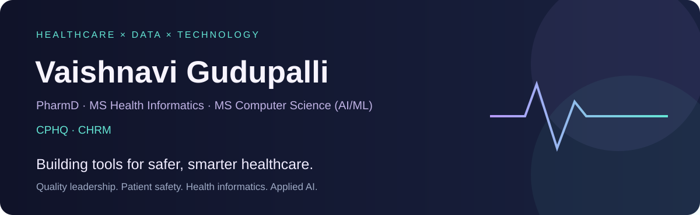
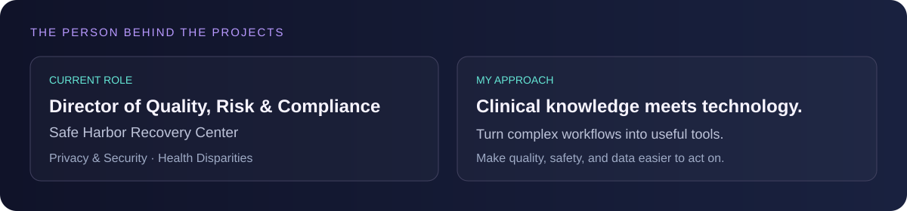
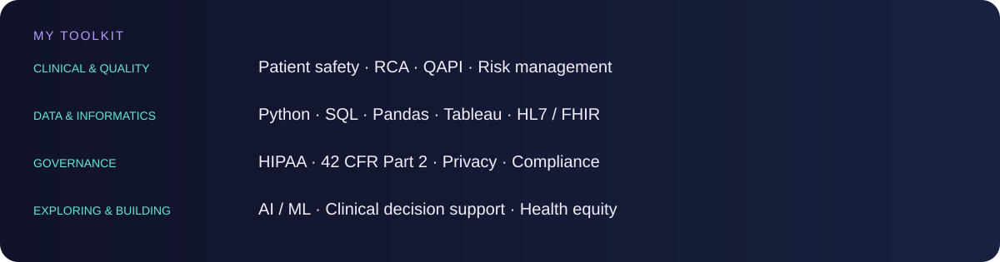
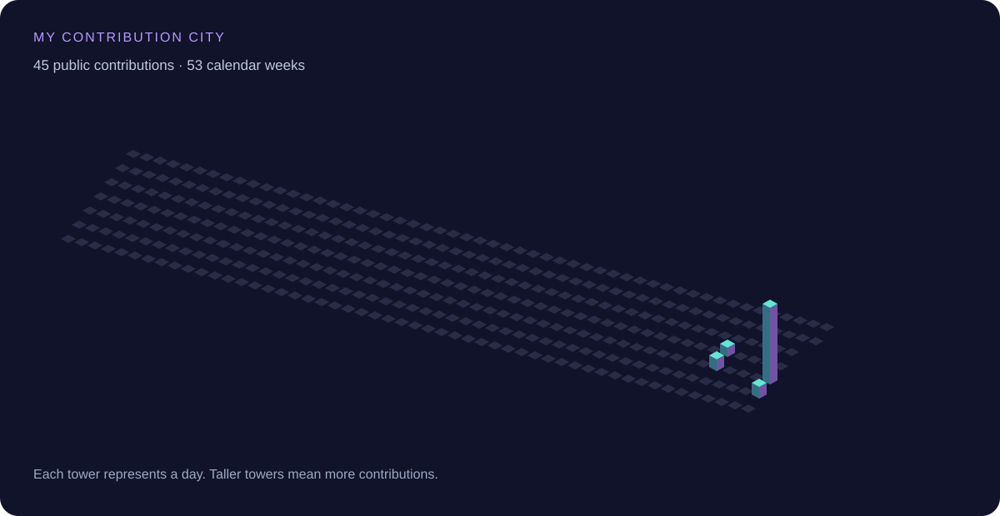

  

  <a href="https://www.linkedin.com/in/vaishnavi-g-a87961224/">LinkedIn</a> ·
  <a href="https://github.com/vgudupal27?tab=repositories">Explore my projects</a>

## Hi, I'm Vaishnavi 👋

I'm a healthcare quality leader with a clinical pharmacy background and master's degrees in Health Informatics and Computer Science (AI/ML). I connect clinical practice, quality improvement, and technology to build practical tools for healthcare teams.

My work focuses on patient safety, risk management, privacy, regulatory compliance, health equity, and data-informed decision-making.

## 🧩 Selected work & interests

| Project / focus | What I'm working on |
| --- | --- |
| **[My Why Recovery Reflection](https://github.com/vgudupal27/vaishnavi-project)** | A development prototype with a guided recovery reflection worksheet, QI dashboard, and outcome tracking. |
| **SUD medication education** | Tools to make medication information easier to find, understand, and share. |
| **Root cause analysis** | Applying Fishbone diagrams, the 5 Whys, and network analysis to understand discharge delays in critical access hospitals. |
| **Quality dashboards** | Translating clinical, operational, and safety data into actionable indicators. |
| **Privacy & compliance education** | Making complex healthcare requirements easier for teams to understand. |
| **Health equity analytics** | Exploring county-level health data, disparities, and access to care. |

[Browse my repositories →](https://github.com/vgudupal27?tab=repositories)

## 🛠️ My toolkit

## 🎓 Education & credentials

**Doctor of Pharmacy** · **MS Health Informatics** · **MS Computer Science (AI/ML)**  
**CPHQ** · **CHRM**

## 🌃 My contribution city

A city built from my actual public GitHub contributions. The daily workflow generates the image after setup; tower heights reflect contribution activity, not healthcare outcomes.

<!-- The workflow inserts the city image here after its first successful run. -->

## 🤝 Let's connect

I'm interested in conversations about healthcare quality, patient safety, informatics, and practical AI applications.

[Connect on LinkedIn](https://www.linkedin.com/in/vaishnavi-g-a87961224/)

Clinical perspective. Data-driven thinking. Practical tools.

